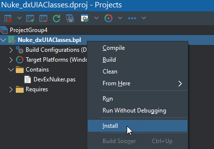
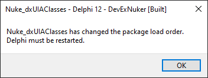
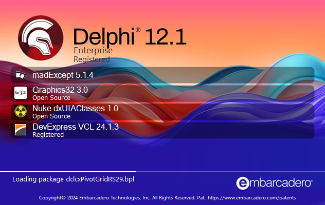

# Nuke dxUIAClasses

### Purpose

**Nuke_dxUIAClasses** is a Delphi design-time package which prevents the DevExpress design-time packages from adding `dxUIAClasses` to the uses clause of any form or frame that uses a DevExpress control.

### Installation

1. Open `Nuke_dxUIAClasses.dpk` in Delphi.
2. From the IDE project manager, right-click the project and select Install. 
   
   
4. Delphi will compile the package and install it.
   Once the package has installed it will prompt you to restart Delphi. 
   
   
6. Restart Delphi.
   The Delphi splash screen should display the package being loaded *before* the DevExpress packages. 
   
   

### What it does

The package intercepts the DevExpress design-time packages' registration of selection editors.
One of the things these selection editors does is provide the IDE with a list of units that should be added to the uses clause of form units when the form (or frame) contains components derived from `TcxControl` or `TcxCustomButton`.

This package replaces the two relevant DevExpress selection editors with its own custom selection editors.

These custom selection editors simply call the original DevExpress selection editors to get a list of units but then remove `dxUIAClasses` from the list of units.

### Under the hood

One detail that makes this whole thing a bit difficult is that once a design-time package has registered a selection editor there is no way to modify or influence the registration.
Therefore the DevExpress registrations must be intercepted and redirected by something that has been loaded by the IDE *prior* to the DevExpress packages being loaded.

The load order of design-time packages is dictated by the order in which they are listed in the registry and the order of registry entries is the order in which they were created (RegEdit displays them sorted but that is not their real order).

When Nuke_dxUIAClasses is loaded by the IDE it examines the order of packages listed in the registry. If it finds that any DevExpress packages are listed before itself, then it reorders the entries and prompts the user to restart Delphi so the packages can be loaded in the required order.

### Why

See DevExpress issue T1246126: [dxUIAClasses automatically added to uses clause](https://supportcenter.devexpress.com/ticket/details/t1246126/dxuiaclasses-automatically-added-to-uses-clause)
